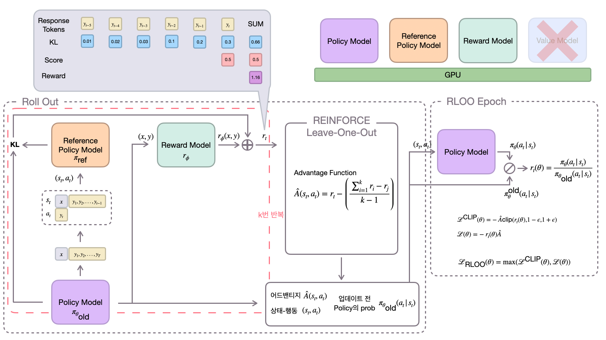

# Summarization with Reinforcement Learning

**Back to Basics: 강화학습을 적용한 요약 모델 개발**

## 개요

이 프로젝트는 RLOO 학습 방법을 사용하여, 강화학습을 통한 요약 모델의 성능 향상을 탐구합니다. 실험 결과, 강화학습 기반의 접근 방식이 요약 모델의 성능을 효과적으로 향상시킬 수 있음을 보여주었습니다.


## 설치

1. **레포지토리 클론**:

   ```bash
   git clone https://github.com/username/summarization-rl.git
   cd summarization-rl
   ```

2. **필요한 패키지 설치**:

   ```bash
   pip install -r requirements.txt
   ```
3. **전체 파일 경로**:
```
summarization-rloo
├── CSFT
   ├── src
      ├── data.py 
      ├── utils.py
      ├── resource
         ├── data
            ├── 일상대화요약_train.json
            └── 일상대화요약_dev.json
   └── train.py
├── RLOO
   ├── reward.py
   └── rloo.py
├── inference.py
├── utils.py
├── vllm_inference.py
├── requirements.txt
└── deepspeed_zero3.yaml
```

## 실행

1. **CSFT**:
   ```bash
   cd CSFT
   CUDA_VISIBLE_DEVICES=1,3 python -m run.train \
       --model_id `학습시킬 모델 경로` \
       --batch_size 1 \
       --gradient_accumulation_steps 64 \
       --epoch 5 \
       --lr 2e-5 \
       --warmup_steps 20
    ```

2. **Reward Model**:
   ```bash
   cd RLOO
   python3 reward.py --base_model=maywell/EXAONE-3.0-7.8B-Instruct-Llamafied --sft_model_path=fiveflow/exa-base --lr=3e-6 --deepspeed --track --output_dir=models/exaone_reward_model --local_eval_batch_size=1 --seed=44413
    ```

3. **RLOO**:
   ```bash
   cd RLOO
   accelerate launch --config_file deepspeed_zero3.yaml \
    rloo.py \
    --output_dir models/rloo_tldr_t=0.1_ppo=1 \
    --num_ppo_epochs 1 \
    --num_mini_batches 1 \
    --learning_rate 3e-6 \
    --per_device_train_batch_size 1 \
    --gradient_accumulation_steps 2 \
    --total_episodes 450 \
    --model_name_or_path fiveflow/exa-base \
    --sft_model_path fiveflow/exa-base \
    --reward_model_path exaone_reward_modelv2 \
    --local_rollout_forward_batch_size 1 \
    --non_eos_penalty True \
    --response_length 512 \
    --stop_token eos \
    --temperature 0.1 \
    --rloo_k 2
    ```

3. **모델 추론**:

   ```bash
   python3 inference.py --model_path fiveflow/exa_rlo --input_file test.json --output_file output.json
   ```
   
## 결과

- RLOO 방식은 G-Eval Metric 기준으로 Base 모델 대비 0.12점 향상 (7.62/10)
- RLOO 방식이 가장 높은 성능을 기록하여, 강화학습의 효과를 입증

## 향후 연구

현재 Llama3.1 모델을 Pruning한 경량화된 모델을 구축하고 있으며, 이를 통해 다양한 파라미터 값에 대한 추가 실험을 계획하고 있습니다. 이러한 접근을 통해 더욱 강력하고 효율적인 요약 모델을 개발할 수 있을 것으로 기대합니다.
